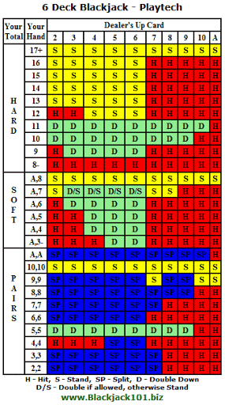
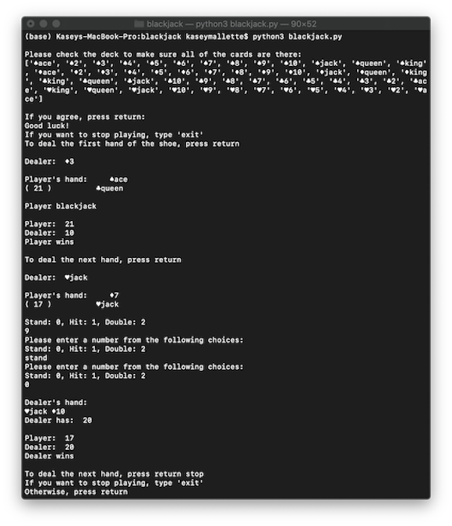
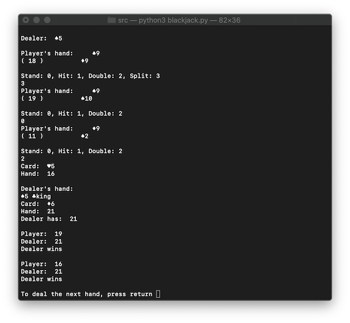
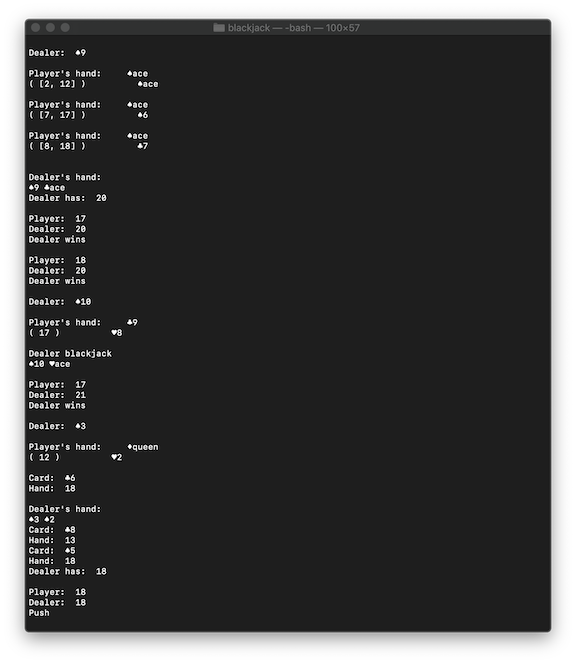
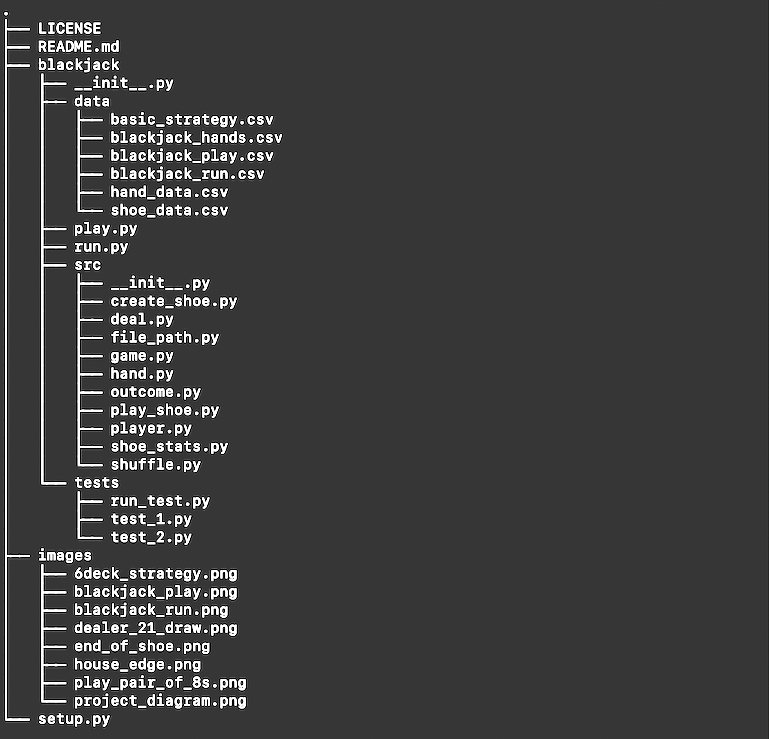

# Blackjack Project

## Introduction

Create a blackjack program that:
(i) allows a single user to continuously play blackjack hands from a six-deck shoe
(ii) uses basic strategy to run through blackjack hands for x number of six-deck shoes
(iii) tracks and exports hand and shoe data for all hands played

## Purpose

The purpose of this project is to examine the efficacy of using basic
strategy when playing blackjack. Due to the inability to collect real data in a
casino, examining basic strategy using a computer program allows a researcher
to measure the actual outcome.

[My Basic Strategy Video](https://www.youtube.com/watch?v=futueqPxCeE)



Based on prior research, a game with the following conditions has a house
advantage of **0.5%**:
- 6 deck shoe with cut card
- Dealer stands on soft 17s
- Player can double on the first two cards
- Player can re-split aces
- Player cannot hit split aces
- Player can split up to four hands

[Wizard of Odds House Edge Calculator](https://github.com/kaseymallette/blackjack/blob/main/images/house_edge.png)

The house advantage means that a player will lose 0.5% of the original bet.
If a player bets the same amount for every hand and plays perfect basic
strategy, the percentage of hands won and pushed should be **49.5%** (win_push_pct).

In addition, I want to explore whether the shuffle or any other relevant
data about the shoe predict win_push_pct, i.e. the number of blackjacks dealt,
the number of doubles won, the number of times the dealer busts, has a 10 showing,
draws to make a hand, or draws to make 21.

## Code

[Create Shoe](https://github.com/kaseymallette/blackjack/blob/main/blackjack/src/create_shoe.py)

```play.py```




```run.py```




## Data Collection

#### Number of Shoes
- It takes 15 minutes to shuffle and deal a six-deck blackjack shoe
- The cards are changed once every 24 hours

Given the above two assumptions, 96 shoes would be dealt in 24 hours.

#### Shuffle Method
```
from random import shuffle
```

The number of times the cards are shuffled: ```[1, 4, 7, 11]```

I also wrote my own module ```shuffle.py```, which adapts casino shuffles using
variations of riffle-strip-riffle.
- *part_1* shuffles the cards using three piles
- *part_2* shuffles the cards using two piles
- *casino* shuffles the cards using both *part_1* and *part_2*


#### ```test_2.py```

```# Set up directory
from run_test import Test
Test().find_dir()

# Import Path
from file_path import Path

# Set variables
test_shuffle = [1, 4, 7, 11, 'part_1', 'part_2', 'casino']
test_shoes = 96
run_time = 7
shoe_fh = Path('shoe_test_2.csv').path
hand_fh = Path('hand_test_2.csv').path

# Run test
for shuffle in test_shuffle:
    for i in range(run_time):
        Test().run_test(shuffle, test_shoes, shoe_fh, hand_fh)
```

## Data Defintions

*hand_data.csv*
variable | definition | key
------ | ------------ | ---
dealer_up | Dealer's up card | A, 2, 3, 4, 5, 6, 7, 8, 9, 10
player | Player's hand | 5-21, soft hands, or pairs
move | Player's first move | 0 = stand, 1 = hit, 2 = double
outcome | The outcome of the hand | win, loss, or push
dealer_bj | Whether or not the dealer had blackjack |
is_split | Whether or not the hand was split |
orig_hand | If the hand was split, the original hand that was dealt | If not split, 0
shuffle | The shuffle method used | 1, 3, 5, 9, 15, part_1, part_2, casino

*shoe_data.csv*
variable | defintion
------ | -----------
player_win | The number of hands the player won
player_loss | The number of hands the player lost
push | The number of hands the player pushed (tied)
win_push | The number of hands both won and pushed
total_hands | The total number of hands dealt in the shoe
win_pct | The percentage of hands won
win_push_pct | The percentage of hands won and pushed
doubles_won | The number of hands the player doubled and won
doubles_lost | The number of hands the player doubled and lost
doubles_won_pct | The percentage of hands doubled that the player won
player_bj | The number of hands the player was dealt blackjack
dealer_bj | The number of hands the dealer was dealt blackjack
dealer_ten | The number of hands the dealer had a 10 showing
dealer_bust | The number of hands the dealer busted (hand > 21)
dealer_draw | The number of hands the dealer hit and stood on 17-21
dealer_21_draw | The number of hands the dealer hit and drew to 21
dealer_ten_pct | The percentage of total hands the dealer had a 10 showing
dealer_bust_pct | The percentage of total hands the dealer busted
dealer_draw_pct | The percentage of total hands the dealer drew to make a hand
dealer_21_draw_pct | The percentage of total hands the dealer drew to 21
dealer_avg_hand | The average hand of the dealer when hand < 21
num_of_shuffles | The number of shuffles of the same shoe
shuffle_method | The shuffle method used to shuffle the shoe

## Project Directory



## UML Project Diagram


## Deck
`Please check the deck to make sure all of the cards are there:`

:spades:ace  :spades:2  :spades:3  :spades:4  :spades:5  :spades:6  :spades:7  :spades:8  :spades:9  :spades:10  :spades:jack  :spades:queen  :spades:king :diamonds:ace  :diamonds:2  :diamonds:3  :diamonds:4  :diamonds:5  :diamonds:6  :diamonds:7  :diamonds:8  :diamonds:9  :diamonds:10  :diamonds:jack :diamonds:queen  :diamonds:king  :clubs:king  :clubs:queen  :clubs:jack  :clubs:10  :clubs:9  :clubs:8  :clubs:7  :clubs:6  :clubs:5  :clubs:4  :clubs:3 
:clubs:2  :clubs:ace  :hearts:king  :hearts:queen  :hearts:jack  :hearts:10  :hearts:9  :hearts:8  :hearts:7  :hearts:6  :hearts:5  :hearts:4  :hearts:3 :hearts:2  :hearts:ace 

```If you agree, press return. 
Good luck! 
If you want to stop playing, type 'exit'
To deal the first card, press return```

